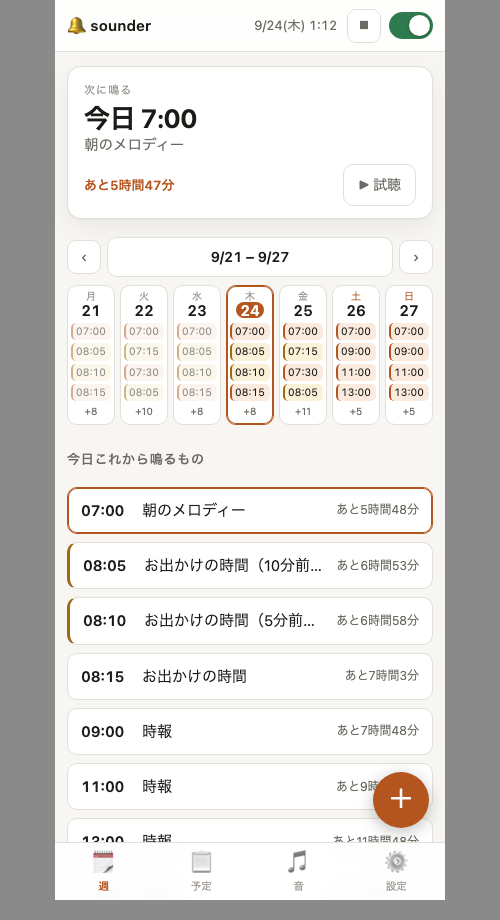
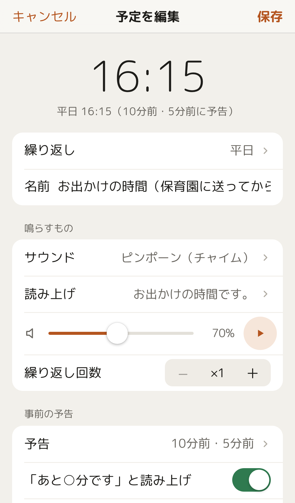
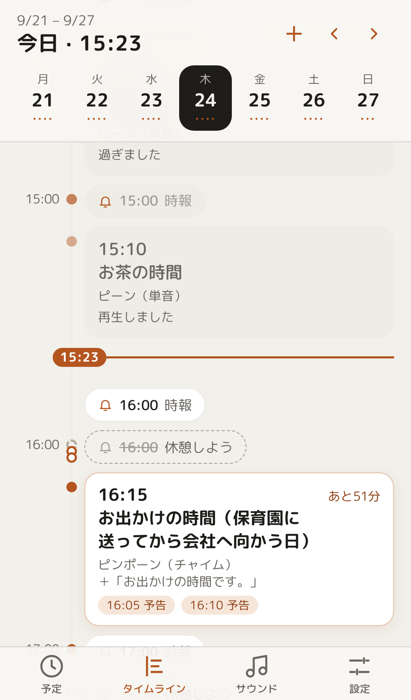

# sounder

Mac（Mac mini を想定）を「時間になったら音を鳴らす・読み上げる箱」にするツールです。
スマホや Mac のブラウザで予定を登録すると、時刻になったらチャイムや読み上げが Mac から鳴ります。

- 本体は macOS 標準の `python3` / `afplay` / `say` だけで動きます（pip 不要・外部サービス不要）。
- 画面は iPhone の時計アプリ風。ホーム画面に追加して PWA としても使えます。
- 機械学習の声（Qwen3-TTS・AivisSpeech）、カレンダー連携、効果音などは **必要なものだけ後から追加** します。

<p align="center">
  
  
  
</p>

## すぐ試す

```sh
git clone https://github.com/kotamorishi/sounder.git && cd sounder
./run.sh                      # → http://127.0.0.1:8777/ （停止は Ctrl-C）
```

ログイン時に自動起動し、スマホからも使う場合は [AGENTS.md](AGENTS.md) のセットアップ手順へ。
（人が読んでも、AI エージェントに渡しても進められるように書いてあります）

## できること

| 機能 | 概要 | 追加で必要なもの |
| --- | --- | --- |
| 予定 | 毎週・毎月（月末も）・毎年・1 回だけ・一定間隔。事前の予告（「あと 10 分です」） | なし |
| 鳴らすもの | 内蔵チャイム 14 種（Mac 内で合成）、自分の音楽ファイル、システムサウンド、読み上げ、ランダム | なし |
| お休みの日 | 予定ごとに「祝日は鳴らさない」「学校の休校日は鳴らさない」 | なし（暦はオンタリオ州の祝日と TDSB。下記） |
| タイムライン | 1 日の予定を時間軸で表示。鳴らない理由（禁止時間・祝日など）も分かる | なし |
| 検索 | 音・声の一覧を検索・絞り込み | なし |
| 自然な声 | Qwen3-TTS（日本語・英語、アナウンサー風、言葉で説明して声を作る） | Apple Silicon・約 4〜11GB |
| 日本語の声を増やす | AivisSpeech（AivisHub の声を追加できる） | AivisSpeech.app |
| カレンダー連携 | Mac のカレンダー（iCloud の共有カレンダーも）の予定を N 分前に読み上げ | Xcode か Command Line Tools |
| 効果音 | 効果音ラボの約 1,400 種を各自の Mac に取り込み | ネット接続（取り込み時のみ） |
| AI（オプション） | 朝に今日の予定をまとめて読み上げ（祝日・休校日にも触れる）。OpenAI 互換の API（vLLM・Ollama など）を使う | 手元の AI サーバ |
| スマホ・外出先 | Tailscale の HTTPS で PWA として使う | Tailscale |

鳴らしすぎない工夫もあります：禁止時間、全体オフ、スリープ復帰などで 2 分以上遅れた予定は鳴らさない、停止ボタン。
**Mac がスリープしている間は鳴りません**（スリープしない設定にしてください）。

### 地域に依存する部分

「お休みの日」の暦は、作者の住むカナダ・オンタリオ州向けです。

- **オンタリオ州の祝日**：毎年計算します（土日に重なったら振替休日）。
- **TDSB（トロント教育委員会）の休校日**：PA デー・長期休みなどを公式 PDF から `sounder/daysoff.py` の `TDSB_YEARS` に
  書き写しています（現在 2026-27 年度まで）。毎年 1 年分を足す必要があります。データのない日は普段どおり鳴らします。

ほかの地域の暦は、`sounder/daysoff.py` の `CALENDARS` と `reason()` に足せば、予定の設定画面に出ます。

## データとプライバシー

- 予定・設定・ログ・読み上げのキャッシュ・カレンダーの写しは、すべて `data/`（git の対象外）に置かれます。
  バックアップは `data/config.json` だけで足ります。
- 通信するのは、あなたが追加した機能の初回ダウンロード（モデル・効果音）だけです。予定の中身は外に出ません。
- 既定の待ち受けは `127.0.0.1` のみ。LAN やスマホに出すときは合言葉（トークン）を付けます。
  家の外から使うなら、LAN に直接公開するより Tailscale（tailnet 内だけの HTTPS）を勧めます。

## 開発

```sh
python3 -m unittest discover -s tests   # 全テスト（音は鳴りません。macOS の python3 3.9 以上）
python3 tests/coverage_report.py        # 行カバレッジ
```

- 本体（`sounder/`）は Python 標準ライブラリだけで書き、外部パッケージを入れません。機械学習の声は別プロセス。
- 画面（`web/`）はビルドなしの素の JavaScript。`web/lib.js` の純関数は macOS 標準の JavaScriptCore でテストします。
- 見た目の確認は `tests/ui/`（ヘッドレス Chrome でスクリーンショット）。画面の設計は [docs/ui-redesign-b.md](docs/ui-redesign-b.md)。
- コメントや画面の文言は日本語です。

## ライセンス

[MIT](LICENSE)。同梱の書体 M PLUS Rounded 1c は SIL Open Font License 1.1（`web/fonts/OFL.txt`）。
Qwen3-TTS・AivisSpeech の声のモデル、効果音ラボの効果音は同梱していません（各自の Mac に取り込み、それぞれの規約に従います。
効果音ラボの音は再配布禁止です）。
