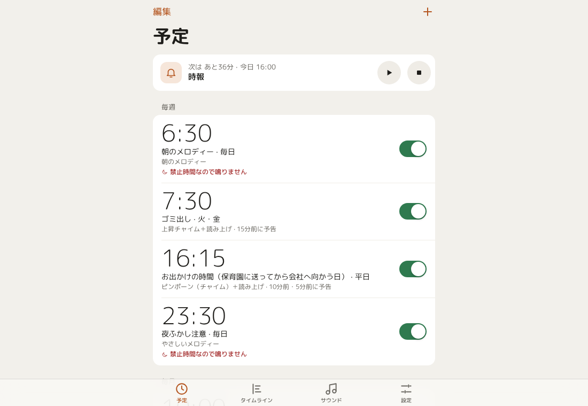

# sounder

Mac mini を「時間になったら音を鳴らす箱」にする小さなツールです。
ブラウザ（スマホでも Mac でも）から予定を登録すると、時刻になったらチャイム・メロディー・
読み上げを鳴らします。お出かけ時刻の 10 分前に「ピンポーン」で予告する、といった使い方を想定しています。

- **この Mac の中だけで完結します。** 外部のサービスには一切つなぎません。
- **追加インストール不要。** macOS の python3 / `afplay` / `say` だけで動きます（pip も不要。自然な声の Qwen3-TTS は任意で追加）。
- 待ち受けは既定で `127.0.0.1` のみ。同じ Mac のブラウザからしか開けません。

<p align="center">
  
  
  
</p>



## すぐ使う

```sh
./run.sh
```

→ ブラウザで <http://127.0.0.1:8777/> を開きます（停止は Ctrl-C）。

ログインしたら自動で動き続けてほしい場合:

```sh
scripts/install-service.sh                        # この Mac の中だけ（ポート 8777）
scripts/install-service.sh 8777 0.0.0.0 himitsu   # 同じ LAN のスマホからも開く（合言葉つき）
scripts/status.sh                                 # 動作確認とアクセス先の表示
scripts/uninstall-service.sh                      # 自動起動をやめる
```

落ちても launchd が起こし直します。Mac を再起動してもログインすれば自動で立ち上がります。
`scripts/status.sh` は合言葉つきの URL（スマホ用も）をそのまま表示します。

## 画面

iPhone の Safari で使うことを基準にした、iOS の時計アプリに似た画面です
（詳しい仕様は [docs/ui-redesign-b.md](docs/ui-redesign-b.md)）。Mac の広い画面では中央寄せの 1 カラムで表示します。
下のタブで 4 つの画面を行き来します（ブラウザの戻る操作でも前のタブに戻れます）。

| タブ | 中身 |
| --- | --- |
| **予定** | 次に鳴るものの帯（試聴・停止ボタンつき）と、毎週／毎月／毎年／一定間隔／1回だけ に分けた予定の一覧。スイッチでオン／オフ、行をタップで編集、「編集」で削除・複製 |
| **タイムライン** | 選んだ日の 0:00〜24:00 を縦の時間軸で表示。現在時刻の線、予告、過ぎた予定の結果（再生した／鳴らさなかった）、鳴らない理由が分かります。「＋」でその日に 1 回だけの予定を作れます |
| **サウンド** | 内蔵サウンドの試聴、自分の音楽ファイルの追加・削除 |
| **設定** | 全体のオン／オフ、止める、音量・読み上げの声と速さ、禁止時間、実行ログ |

予定の追加・編集は下からせり上がるシートで行います。「繰り返し ›」「サウンド ›」「読み上げ ›」「予告 ›」は
右から出てくる子画面で選びます。新しく作るときは「よく使う型」（お出かけ・時報・ゴミ出し・毎月の支払い・記念日など）
から始められます。

禁止時間や全体オフで鳴らない予定は、次の予定の帯・一覧・タイムラインのそれぞれで、
月のアイコンや破線・赤字の「〜なので鳴りません」で分かるようにしてあります。

### 書体

画面の書体は [M PLUS Rounded 1c](https://github.com/coz-m/MPLUS_FONTS)（Light / Regular / Medium / Bold）です。
`web/fonts/` に woff2 を同梱して sounder 自身が配信するので、Google Fonts などの外部には取りに行きません
（`/fonts/` だけ長期キャッシュさせています）。ライセンスは SIL Open Font License 1.1 で、
全文を `web/fonts/OFL.txt` に置いています。日本語は意味のまとまりの途中で改行しないように組んであります。

## 予定の考え方

予定はひとつの「いつ」と「何を鳴らすか」の組です。

| 繰り返し方 | 意味 | 例 |
| --- | --- | --- |
| 毎週 | 選んだ曜日の決まった時刻 | 平日 8:15 |
| 毎月 | 毎月の決まった日 | 毎月25日 10:00／毎月末 7:30 |
| 毎年 | 毎年の決まった月日 | 毎年1月1日 9:00 |
| 1回だけ | 指定した日付と時刻（鳴ったら自動でオフ） | 9/25 7:00 |
| 間隔 | 時間帯の中を一定分ごと | 9:00〜21:00 の 60 分ごと |

毎月の「31日」は 31 日がある月だけ鳴ります。2 月も含めて毎月必ず鳴らしたいときは
**月末**を選んでください（2月は28日、うるう年は29日に鳴ります）。

### お休みの日は鳴らさない（祝日・学校の休校日）

「繰り返し ›」の下のほうで、予定ごとに **お休みの日** を選べます（1 回だけの予定以外）。
選んだ暦で休みの日は、本番も予告も鳴りません。タイムラインには「PA デーのため鳴りません」
のように破線で出て、日付の横に「サンクスギビング」などが表示されます。

| 暦 | 休みになる日 |
| --- | --- |
| オンタリオ州の祝日 | 元日・ファミリー・デー・グッドフライデー・ビクトリア・デー・カナダ・デー・レイバー・デー・サンクスギビング・クリスマス・ボクシング・デー。土日に重なったら次の平日が振替休日。毎年この Mac で計算します |
| TDSB の休校日（小学校 JK〜8 年生） | PA デー・冬休み・ミッドウィンター・ブレイク（3 月休み）・イースター・マンデー・学期中の祝日・新学期前・夏休み・週末 |
| TDSB の休校日（中高 9〜12 年生） | 同上（PA デーの日と最終日が小学校と少し違います） |

シビック・ホリデー（8 月第 1 月曜）は州の祝日ではないので含めていません。
例: 「平日 7:30・祝日は休み」の出勤アラーム、「平日 15:00・TDSB 小学校の休校日は休み」のお迎え。

**TDSB の予定表は毎年書き足します。** TDSB は予定表を PDF（[School Year Calendar](https://www.tdsb.on.ca/About-Us/School-Year-Calendar) の
「Key Dates」）でしか出していないので、公式の日付を `sounder/daysoff.py` の `TDSB_YEARS` に
書き写しています。いまは **2026-27 年度（2027 年 8 月 31 日まで）** が入っています。
その先の日は「分からない」として普段どおり鳴らします（鳴らし忘れを防ぐため）。
翌年度の Key Dates が出たら、同じ形で 1 年分を足してください。

**事前の予告**を付けると、本番の時刻より前に短い合図が鳴ります（10 分前・5 分前など、
最大 8 段）。「あと○分です」と読み上げさせることもできます。深夜 0 時台の予定に
30 分前の予告を付ければ、前日の 23:30 に鳴ります。

鳴らすものは 3 通りです。

- **サウンド** … 内蔵チャイム／自分の音楽ファイル／macOS のシステムサウンド
- **読み上げ** … `say` で文章を読み上げ（日本語の声を自動で選びます。声の一覧には日本語と英語の声だけを出します）。
  [機械学習の声](#もっと自然な声qwen3-tts) を入れると、そちらも選べます
- **両方** … チャイムのあとに読み上げ

### 効果音（効果音ラボ）とランダム再生

[効果音ラボ](https://soundeffect-lab.info/) の効果音を、この Mac に取ってきて使えます。
**再配布が禁止されているのでリポジトリには入っていません。** 各自の Mac で取ってきてください。

```sh
python3 -m sounder.effects                                          # 声素材以外の全分類（約 1,400 種・約 290MB）
python3 -m sounder.effects https://soundeffect-lab.info/sound/animal/    # 分類を選んで
```

- `sounds/effects/<分類>/` に mp3 と一覧（manifest.json）が入り、サウンドの一覧に「効果音ラボ」として出ます。
- サウンドの一覧の **「ランダム」** を選ぶと、鳴らすたびにその中から 1 つを選んで鳴らします。
  分類ぜんぶ（例: ボタン・システム音 103 種）か、似た音の組（例: 決定ボタンを押す 53 種）から選べます。
- 取得は 1 秒に 1 ファイルずつ。取得済みのものは取り直しません。続きのページ（battle2.html など）もたどります。
- 数が多いので、分類ごとに折りたたんで出します。サウンドの一覧・選ぶ画面・声の一覧には **検索欄** があり、
  「鳥」「チャイム」「決定」のように探せます（ひらがな・カタカナ、全角・半角の違いは気にしません）。
  サウンドは「ランダム」「内蔵」「効果音ラボ」などで絞り込めます。

### 内蔵サウンド

ピンポーン、時報（ウェストミンスター）、朝のメロディー、カッコウ、アラームなど 14 種類を
**初回起動時にこの Mac で合成**して `sounds/builtin/` に置きます。音源ファイルを
どこからもダウンロードしません。気に入らなければ `sounder/tones.py` を書き換えて
`python3 -m sounder.tones sounds/builtin --force` で作り直せます。

自分の音楽を使う場合は「音」タブからアップロードしてください
（mp3 / m4a / wav / aiff など、30MB まで。`sounds/user/` に置かれます）。

### もっと自然な声（Qwen3-TTS）

`say` の声が機械っぽいと感じたら、この Mac の中で動く音声合成モデル
[Qwen3-TTS](https://qwen.ai/blog?id=qwen3tts-0115)（1.7B、Apache-2.0）を追加できます。
Apple Silicon 専用で、[`uv`](https://docs.astral.sh/uv/)（`brew install uv`）が必要です。

```sh
scripts/install-tts.sh      # 専用の Python 環境を .venv-tts/ に作り、自動起動に登録
```

- 初回はモデル（約 4GB）をダウンロードします。動いている間はメモリを 3〜4GB ほど使います（[休ませる](#機械学習の声を休ませる)）。
- 準備ができると、声の一覧の先頭に「Ono Anna（Qwen3-TTS）」（日本語）、
  「Ryan」「Aiden」（英語）などが出ます。文章にかなが入っていれば日本語として読みます。
- 1 文の生成に数秒かかるので、**鳴る 3 分前から先に作っておきます**。
- どの話者にも **アナウンサー風**（「Ono Anna・アナウンサー風」など）があり、ニュースを読むような
  落ち着いた話し方で読みます。
- **言葉で説明して声を作れます**（設定 → 読み上げの声 → 声を作る）。「40代の落ち着いた女性アナウンサー。
  低めで柔らかく、はっきりした発音」のように書くと、VoiceDesign モデルが見本の声を 1 本作って
  `data/voices/` に保存し、以後は Base モデルがその声で読みます（毎回同じ声になります）。
  作った声を初めて使うときは Base モデル（約 3.6GB）も読み込むので、メモリを多めに使います。
- 「話す速さ」の設定は `say` の声だけに効きます。
- モデルのサーバ（127.0.0.1:8778、外からは見えません）が止まっていたら、
  **標準の声（`say`）で代わりに読み上げます**。鳴らないことはありません。
- 解除は `scripts/uninstall-tts.sh`。sounder 本体は今までどおり標準ライブラリだけで動きます。

### 日本語の声をもっと（AivisSpeech）

[AivisSpeech](https://aivis-project.com/)（日本語専用の音声合成、無料）の声も使えます。
[リリース](https://github.com/Aivis-Project/AivisSpeech/releases) から Apple Silicon 版を
`/Applications` に入れてから、エンジンを自動起動に登録します。

```sh
scripts/install-aivis.sh    # AivisSpeech.app の中のエンジンを 127.0.0.1:10101 で使えるようにする
```

- 声の一覧に「まお・ノーマル（AivisSpeech）」のように、話者とスタイルの組ごとに出ます。
  声（モデル）は AivisSpeech のアプリや [AivisHub](https://hub.aivis-project.com/) から追加でき、
  エンジンを再起動すると一覧に増えます。
- Qwen3-TTS と違い、**「話す速さ」が効きます**（180 が普通の速さ、90〜400 を 0.5〜2 倍に置き換え）。
- 読み上げの作りおき・キャッシュ・止まっているときの `say` への切り替えは Qwen3-TTS と同じです。
- アプリ（画面のある AivisSpeech）も同じポート 10101 でエンジンを使うため、ぶつかる場合があります。
  うまく動かないときは `scripts/uninstall-aivis.sh` で一度止めてからアプリを使ってください。

### 機械学習の声を休ませる

Qwen3-TTS と AivisSpeech は動いている間それぞれメモリを 3GB ほど使うので、
**しばらく使われなければ sounder が止め、次に声が要るときに自動で起こします**
（起こすのに数秒〜10 秒）。どちらも常駐はさせず、ログイン時にも起動しません。

- 何分使われなかったら休ませるかは、設定タブの「機械学習の声」で選べます（既定 30 分、休ませないも可）。
- 予定の読み上げは鳴る 3 分前から用意するので、休んでいても時刻どおりに鳴ります。
- 休んでいる間も、声の一覧には最後に見えた声が出ます。試聴すると、起こしてから読み上げます。
- 起こせなかったときは、いつもどおり標準の声（`say`）で代わりに読み上げます。

### 読み上げは取っておく

一度作った読み上げは `data/tts-cache/` に取っておき、**声・速さ・文章が同じなら作り直さずに鳴らします**
（`say` の声も含めて全部。見分けは声・速さ・文章の SHA-256）。鳴らすたびに「使った日」を更新し、
**30 日使われなかったものは自動で消します**（見回りは 1 日 1 回）。

## 鳴らしすぎないための作り

- **禁止時間**（設定タブ）… その時間帯に来た予定は鳴らさず、ログに残します。
- **取りこぼしは鳴らさない** … スリープ復帰などで 2 分以上遅れた予定は鳴らしません。
  起動した瞬間に溜まった予定が一斉に鳴る、という事故を防いでいます。
- **全体オフ** … 設定タブのスイッチで、予定を消さずに全部止められます（予定タブの帯からオンに戻せます）。
- **停止ボタン** … 鳴っている音と、順番待ちの音をその場で止めます（予定タブの帯と設定タブにあります）。
- 書き込み API は別サイトからのリクエスト（`Origin` 不一致）を拒否します。

## 眠っている Mac は鳴りません

macOS がスリープ中は何も鳴りません。常に鳴らしたいなら、どれかを選んでください。

- システム設定 →「エネルギー」で **ディスプレイを切ってもスリープしない** にする
- 予定の少し前に起こす: `sudo pmset repeat wakeorpoweron MTWRF 08:00:00`
- 常時起こしておく: `caffeinate -s`（開発中の手元確認向け）

## Tailscale で HTTPS にして、アプリ（PWA）として使う

Mac mini が [Tailscale](https://tailscale.com/) に参加していれば、`tailscale serve` で
**tailnet の中だけに** HTTPS で公開できます（インターネットには出ません）。

```sh
/Applications/Tailscale.app/Contents/MacOS/Tailscale serve --bg --https=443 http://127.0.0.1:8777
# → https://<Mac の名前>.<tailnet>.ts.net/ 　止めるときは同じコマンドの最後を "off" に
```

- スマホにも Tailscale を入れて同じアカウントでログインし、`https://…ts.net/?t=<合言葉>` を開きます。
- 共有メニューの「ホーム画面に追加」（Android の Chrome は「アプリをインストール」）で、
  アドレスバーのない **アプリ（PWA）** になります。HTTPS なので、サービスワーカーも入ります。
  - 画面のファイルは毎回 Mac から取り、つながらないときだけ前回の画面を出します。
    予定や設定などのデータは取っておきません。
- 家の外からでも、Tailscale がつながっていれば使えます。
- iPhone のホーム画面から開いたアプリはブラウザと Cookie が別なので、最初の 1 回だけ合言葉を聞かれます。

## 同じ LAN のスマホから開きたいとき

既定ではローカルのみです。あえて公開する場合は合言葉を付けてください。

```sh
python3 -m sounder --host 0.0.0.0 --port 8777 --print-token
```

表示された `http://<MacのIP>:8777/?t=xxxx` を開くと、以後はブラウザが合言葉を覚えます。
合言葉を忘れたブラウザで開くと、入力欄だけの小さな画面が出ます
（この画面のためにフォントとアイコンだけは合言葉なしで配っています）。

iPhone なら Safari の共有 →「ホーム画面に追加」でアプリのように開けます
（アイコンは `python3 -m sounder.icon web` で作った PNG を使っています）。

HTTPS ではないので、信頼できる自宅の LAN 以外では使わないでください。

## ファイルの置き場所

```
sounder/           アプリ本体
  tones.py         内蔵チャイム／メロディーの合成
  config.py        設定ファイルの読み書きと入力検証
  player.py        afplay / say の呼び出し
  neural.py        Qwen3-TTS・AivisSpeech への橋渡しと音声のキャッシュ
  effects.py       効果音ラボの音を取ってくる
  speechcache.py   読み上げの取り置き（30 日で消す）
  calendarfeed.py  カレンダーの予定を読み上げの予定にする
  daysoff.py       お休みの日の暦（オンタリオ州の祝日の計算・TDSB の休校日）
  scheduler.py     いつ鳴らすかの計算と 1 秒ごとの判定
  eventlog.py      実行ログ
  icon.py          アイコン PNG の生成
  server.py        HTTP サーバ（API と画面の配信）
web/               画面（外部CDNなし）
  index.html       画面の骨組み
  style.css        見た目（iPhone の幅を基準に、広い画面では中央寄せ）
  lib.js           日付や表示文字列の純関数（テスト対象）
  app.js           画面の組み立てとサーバとのやりとり
  unlock.html      合言葉の入力画面
  sw.js            サービスワーカー（HTTPS で開いたときの PWA 用）
  icon-*.png       ホーム画面用のアイコン（sounder/icon.py で生成）
  fonts/           同梱の M PLUS Rounded 1c（woff2）とライセンス（OFL.txt）
tts/qwen_server.py Qwen3-TTS を常駐させる小さなサーバ（.venv-tts/ で動く）
tools/calendar/    カレンダー連携の補助アプリ（Swift・EventKit）
sounds/builtin/    自動生成されるチャイム
sounds/user/       アップロードした音
sounds/effects/    効果音ラボから取ってきた音（git には入れない）
data/config.json   予定と設定（これだけバックアップすれば復元できます）
data/events.log    実行ログ
data/tts-cache/    読み上げの取り置き（30 日使われなければ消える。消してもかまいません）
data/calendar.json 補助アプリが書き出したこれからの予定
data/voices/       言葉で説明して作った声（Qwen3-TTS の見本の声）
tests/             テスト一式
  ui/              画面を PNG に撮って目視確認するための道具
```

## テスト

```sh
python3 -m unittest discover -s tests      # 全部（音は鳴りません）
python3 tests/coverage_report.py           # 行カバレッジ付きで実行
python3 tests/coverage_report.py --missing # 通っていない行も表示
```

`sounder/` の行カバレッジは 100% です。カバレッジ計測も標準ライブラリだけで書いてあります
（`sys.settrace` で行を数え、バイトコードから取り出した実行されうる行と突き合わせます）。

- 発火時刻の計算、予告、取りこぼし、禁止時間、毎月末・毎年などの分岐
- `afplay` / `say` はダミーのスクリプトに差し替えて、渡している引数を検証
- HTTP は実際にポートを開いて API を一通り叩く（CSRF・トークン・パス遡りの拒否も）
- 画面側は macOS 標準の JavaScriptCore で `web/lib.js` を検証し、
  偽のサーバ応答で `web/app.js` を起動させて、初期描画・タイムライン・編集シートの操作がエラーなく終わることを確認
  （jsc の無い環境では node があればそれで走らせます）

見た目の崩れは目で見ないと分からないので、`tests/ui/README.md` の手順で
スマホ幅と Mac 幅のスクリーンショットを撮って確認します。

## API（curl からも使えます）

| メソッド | パス | 内容 |
| --- | --- | --- |
| GET | `/api/state` | 設定・予定・サウンド一覧・ログをまとめて取得 |
| GET | `/api/now` | 現在時刻・次の予定・直近ログ（画面の定期更新用） |
| GET | `/api/calendar?start=YYYY-MM-DD&days=7` | タイムライン用に各日の発火予定（予告・過ぎたもの・禁止時間・実行結果を含む）を返す |
| POST | `/api/schedules` | 予定の追加 |
| PUT / PATCH / DELETE | `/api/schedules/{id}` | 予定の更新・部分更新・削除 |
| POST | `/api/schedules/{id}/test` | その予定を今すぐ鳴らす（`{"which":"lead"}` で予告） |
| POST | `/api/preview` | 指定したサウンドや文章を試聴 |
| POST | `/api/stop` | 鳴っている音を止める |
| GET / POST | `/api/sounds` | サウンド一覧 / アップロード（base64） |
| DELETE | `/api/sounds/{name}` | アップロードした音の削除 |
| PUT | `/api/settings` | 全体設定の更新 |
| GET | `/api/log?limit=100` | 実行ログ |

```sh
# 今すぐピンポーンを鳴らす
curl -X POST http://127.0.0.1:8777/api/preview \
  -H 'Content-Type: application/json' \
  -d '{"type":"sound","sound":"builtin:doorbell","volume":0.6}'
```

## カレンダーの予定を読み上げる（iCloud の共有カレンダーも）

Mac のカレンダー.app に出ている予定（iCloud の共有カレンダー、購読カレンダー、Mac に追加した Google など）を、
開始の N 分前に読み上げます。予定は Mac の中で読むだけで、Apple ID のパスワードも外部との通信も使いません。

```sh
scripts/install-calendar.sh   # 補助アプリ SounderCalendar.app を作り、5 分ごとに予定を data/calendar.json へ書き出す
```

- 初回は Mac の画面に「“sounder カレンダー連携”がカレンダーへのアクセスを求めています」と出るので
  「フルアクセスを許可」を押します（あとから システム設定 → プライバシーとセキュリティ → カレンダー で変更可）。
- 設定タブの「カレンダー連携」で、オン／オフ、読み上げるカレンダー、何分前に読むか（開始時刻・5〜60 分前）、
  前に鳴らす音を選びます。声は既定の声です。例：「10分後に、算数があります。」
- 終日の予定は読みません。禁止時間と「すべての予定を鳴らす」の設定に従います。タイムラインにも出ます。
- Python から直接カレンダーを読むと許可が Python 全体に付いてしまうので、許可を持つのは小さな補助アプリだけにしています。
